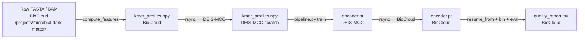

# Cross-cluster data flow

The two clusters — BioCloud and DEIS-MCC — do different jobs. BioCloud stores data and runs CheckM2; DEIS-MCC has the GPUs for training. Making them work together is mostly `rsync` and SSH, plus a couple of conventions that keep paths sane.

## The round-trip



Four stages, two clusters, two rsyncs. Nothing fancy.

## Stage 1 — Compute features on BioCloud

Features are small — a few hundred MB for a CAMI dataset — but they depend on the original FASTA, which is many GB and lives on BioCloud. Compute features where the data lives.

```bash
# On BioCloud
cd /projects/microbial-dark-matter/metagenomic-binning/Metagenomic-Binning
mamba activate megobin

python -c "
import numpy as np
from megobin.features.kmer_profiles import read_fasta, compute_kmer_profiles_with_splits

names, seqs = read_fasta('data/CAMI_medium/contigs.fasta')
filtered = [(n, s) for n, s in zip(names, seqs) if len(s) >= 1000]
kept_names = [n for n, _ in filtered]
kept_seqs  = [s for _, s in filtered]

whole, split = compute_kmer_profiles_with_splits(
    kept_seqs, k=4, canonical=True, alphabet='ATGC',
    pseudocount=1e-5, min_length=1000, split_min_length=2000,
)
np.save('data/CAMI_medium/kmer_profiles.npy', whole)
np.save('data/CAMI_medium/kmer_profiles_split.npy', split)
np.save('data/CAMI_medium/contig_names.npy', np.array(kept_names))
"
```

Or just let Snakemake do it — this is exactly the `compute_features` rule in `hpc/Snakefile`. After this step, `data/CAMI_medium/` has three `.npy` files and the original FASTA.

## Stage 2 — Ship features to DEIS-MCC

Small files, short transfer:

```bash
# From your laptop (relay)
rsync -avz --progress \
  tinni@biocloud.cmc.aau.dk:/projects/microbial-dark-matter/metagenomic-binning/Metagenomic-Binning/data/CAMI_medium/ \
  DB56HW@student.aau.dk@ailab-fe01.srv.aau.dk:/work/DB56HW@student.aau.dk/metagenomic-binning/data/CAMI_medium/
```

Or do it as a two-hop pull if direct BioCloud→DEIS-MCC SSH isn't configured:

```bash
# Laptop pulls from BioCloud, then pushes to DEIS-MCC
rsync -avz tinni@biocloud.cmc.aau.dk:/projects/.../data/CAMI_medium/ ~/stage/CAMI_medium/
rsync -avz ~/stage/CAMI_medium/ DB56HW@student.aau.dk@ailab-fe01.srv.aau.dk:/work/.../data/CAMI_medium/
rm -rf ~/stage/CAMI_medium/
```

You only need the `.npy` feature files on DEIS-MCC — the original FASTA can stay on BioCloud. Training doesn't need sequences, just feature vectors.

## Stage 3 — Train on DEIS-MCC

```bash
ssh DB56HW@student.aau.dk@ailab-fe01.srv.aau.dk
cd /work/DB56HW@student.aau.dk/metagenomic-binning/Metagenomic-Binning
sbatch hpc/slurm/deis_mcc_train.sh uncertain_gen CAMI_medium
```

See [DEIS-MCC](deis-mcc.md) for the details. The output is a checkpoint file at `results/CAMI_medium/uncertain_gen/model.pt`.

## Stage 4 — Ship checkpoint back to BioCloud

```bash
# From laptop
rsync -avz --progress \
  DB56HW@student.aau.dk@ailab-fe01.srv.aau.dk:/work/DB56HW@student.aau.dk/metagenomic-binning/Metagenomic-Binning/results/CAMI_medium/uncertain_gen/model.pt \
  tinni@biocloud.cmc.aau.dk:/projects/microbial-dark-matter/metagenomic-binning/Metagenomic-Binning/results/CAMI_medium/uncertain_gen/model.pt
```

A typical UncertainGen checkpoint is ~2MB. Fast.

## Stage 5 — Evaluate on BioCloud

Now you're back where the CheckM2 database lives:

```bash
# On BioCloud
cd /projects/microbial-dark-matter/metagenomic-binning/Metagenomic-Binning
sbatch --wrap "mamba activate megobin && \
  python megobin/pipeline.py \
    --config-name experiment/training/uncertain_gen_cami_toy \
    resume_from=results/CAMI_medium/uncertain_gen/model.pt \
    dataset=CAMI_medium \
    binner=infomap"
```

The pipeline loads the trained encoder, encodes contigs to embeddings, runs Infomap clustering, writes bin FASTAs, and invokes CheckM2. The output is `quality_report.tsv` and an `eval/*` scalar section in TensorBoard.

## Keeping paths sane across clusters

Three conventions that avoid most path-related bugs:

**Dataset root lives at `data/<dataset>/`** on both clusters, relative to the repo root. Override with `data_dir=` on the CLI if you need to point elsewhere (the SLURM script does this to route to `/scratch/` on DEIS-MCC).

**Output root lives at `outputs/<date>/<time>/`** on both clusters. This is Hydra's default. Don't fight it — use `hydra.run.dir=` overrides to group runs under `outputs/ablation_k_neighbours/` if you're sweeping.

**Checkpoints are portable.** `encoder.pt` saves just the `state_dict`, which is CUDA-device-independent (we `map_location='cpu'` on load). You can train on DEIS-MCC, load on BioCloud, evaluate on your laptop — same file.

Not portable: paths baked into config defaults. `configs/trainer/single_phase.yaml` has `checkpoint_path: ${hydra:runtime.output_dir}/encoder.pt` which is fine (interpolates per-run), but if you ever hardcode `/work/DB56HW@student.aau.dk/...` into a YAML, you've made that config DEIS-MCC-only. Don't do that.

## Automating the round-trip

The round-trip is mechanical enough that it's worth scripting. A minimal `scripts/round_trip.sh` that does (compute → ship → train → ship back → evaluate) in order is on my to-do list; when it exists it'll live under `hpc/` and will be referenced here.

Short version of what that script would do:

1. On BioCloud, run the Snakemake `compute_features` rule.
2. rsync `data/<dataset>/*.npy` to DEIS-MCC scratch.
3. `ssh DEIS-MCC sbatch hpc/slurm/deis_mcc_train.sh ...` and wait for the job.
4. rsync the resulting `model.pt` back to BioCloud.
5. On BioCloud, run `pipeline.py` with `resume_from=...` to finalize the bin+eval loop.
6. Report the `eval/mean_completeness` and `eval/mean_contamination` back to the caller.

Until that exists, running these five commands by hand takes a few minutes of clock time and is fine.

## Why not just use a shared filesystem?

In an ideal world, BioCloud and DEIS-MCC would mount each other's scratch as NFS and there'd be no rsync step. They don't — they're administered separately and have different network segments. Ask Sebastian if you want the full history; short version is that a shared mount has been discussed and is unlikely to happen. `rsync` is the workaround.

Consequence: keep the files you ship small. Features: yes (small). Full CAMI FASTA: no (big, stays on BioCloud). Trained checkpoint: yes (tiny). Full `outputs/<date>/<time>/` tree with TB events and per-phase checkpoints: usually not worth it — rsync the one file you need.

## Checklist before a cross-cluster experiment

1. Features exist on BioCloud? (`ls data/<dataset>/*.npy`)
2. Features rsynced to DEIS-MCC? (`ssh mcc ls /work/.../data/<dataset>/*.npy`)
3. Container present on DEIS-MCC? (`ssh mcc ls /work/.../megobin.sif`)
4. Git SHA consistent on both clusters? (`git rev-parse HEAD` — should match)
5. `environment.yml` hash consistent? (`sha256sum environment.yml` — should match)
6. Run: `sbatch hpc/slurm/deis_mcc_train.sh ...`
7. On completion: rsync checkpoint back.
8. On BioCloud: `pipeline.py resume_from=<ckpt>` for evaluation.
9. Results land in `outputs/<date>/<time>/tb/` on BioCloud; TensorBoard from a login node with SSH forwarding.

Sources:
- [hpc/Snakefile](https://github.com/Tinnifo/Metagenomic-Binning/blob/main/hpc/Snakefile)
- [hpc/slurm/biocloud_pipeline.sh](https://github.com/Tinnifo/Metagenomic-Binning/blob/main/hpc/slurm/biocloud_pipeline.sh)
- [hpc/slurm/deis_mcc_train.sh](https://github.com/Tinnifo/Metagenomic-Binning/blob/main/hpc/slurm/deis_mcc_train.sh)
