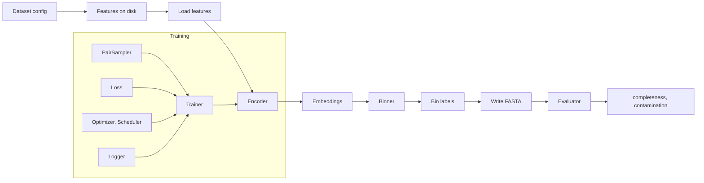

# Pipeline overview

[`megobin/pipeline.py`](https://github.com/Tinnifo/Metagenomic-Binning/blob/main/megobin/pipeline.py) is 230 lines. Read it in full.

## Dataflow

Every arrow is a method call. Every box is a `_target_` in a YAML.

## What pipeline.py does, in order

| Step | Line | Action |
|------|------|--------|
| Seed | 30 | `seed_everything(cfg.seed)` |
| Signal check | 58 | Compares `features.required_signals` vs `dataset.signals`. Aborts before I/O on mismatch. |
| Instantiate | 108–116 | `hydra.utils.instantiate` for encoder, loss, binner, evaluator. |
| Load features | 121–146 | Reads `kmer_profiles.npy`, optionally `abundance.npy`, optionally `contig_names.npy`. |
| Logger | 149–153 | Instantiate + `log_config`. |
| Train or resume | 156–177 | If `resume_from` set, `load_checkpoint`. Else `trainer.fit(encoder, sampler, loss_fn)`. |
| Encode | 180 | `encoder.encode(features)` → embeddings. |
| Cluster | 184 | `binner.cluster(embeddings)` → labels. |
| Write FASTAs | 188–208 | One FASTA per unique bin ID. |
| Evaluate | 211–225 | `evaluator.score(bins_dir)` → DataFrame. CheckM2 missing → warning, continue. |
| Logger finish | 227 | Flush + close. |

`_instantiate_sampler` introspects each sampler's `__init__` and passes only the on-disk arrays it asks for.

## What runs where

- **Offline, once per dataset** — feature computation (`megobin/features/`), via Snakefile on BioCloud.
- **Per experiment** — all of `pipeline.py`.
- **Per evaluation** — `resume_from` skips training. Useful for binner ablations.

## Not in pipeline.py

- Feature computation — Snakefile rule.
- DDP / multi-GPU — current trainers are single-process.
- Sweeps — Hydra's `-m` multirun handles this.
