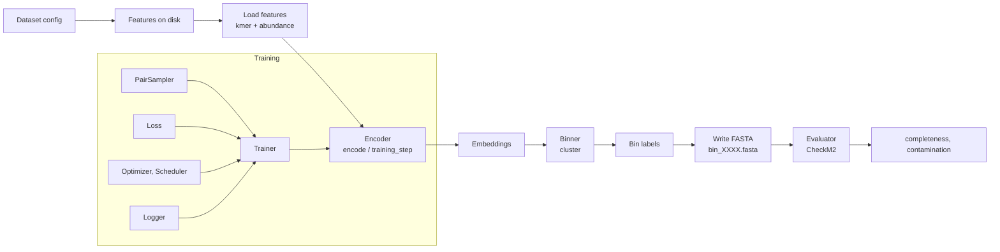

# Pipeline overview

Chapter 1 gave you a one-line architecture diagram. This chapter unpacks it into an honest walk through `megobin/pipeline.py` — the 230-line entry point that Hydra calls. By the end you will know what happens, in order, on every `python megobin/pipeline.py ...` invocation, and where to intervene if you want to change one step.

## The dataflow



Every arrow is a method call. Every box is a `_target_` in a YAML file.

## The entry point, line by line

[`megobin/pipeline.py`](https://github.com/Tinnifo/Metagenomic-Binning/blob/main/megobin/pipeline.py) is worth reading in full — it is intentionally flat, with no helpers hiding the flow of control. The structure below is faithful to the file.

**Seed everything (line 30).** `seed_everything(cfg.seed)` seeds Python `random`, NumPy, CPU PyTorch, and CUDA. Every experiment is seeded from `cfg.seed`; the default across shipped configs is 42.

**Signal-compatibility check (line 58).** `_check_signal_compatibility(cfg)` compares `cfg.features.required_signals` (a list like `[kmers, abundance]`) against `cfg.dataset.signals` (a list like `[kmers, abundance, taxonomy]`). Mismatches abort with a `ValueError` **before** any file I/O. This is the one place you will feel Hydra's "opt-in schema" style — both sides have to declare their signals for the check to fire.

**Instantiate core components (lines 108–116).** Four calls, one per slot:

```python
encoder = hydra.utils.instantiate(cfg.encoder)
loss_fn = hydra.utils.instantiate(cfg.loss)
binner = hydra.utils.instantiate(cfg.binner)
evaluator = hydra.utils.instantiate(cfg.evaluator)
```

`hydra.utils.instantiate` takes a DictConfig with a `_target_` key and returns the instance. Because every `configs/{slot}/*.yaml` file is just `_target_: <fqn>` plus constructor kwargs, this call is all it takes. The four resulting objects are ordinary Python instances — not wrapped, not proxied.

**Feature loading (lines 121–146).** `cfg.dataset.path` points at a directory on disk. `pipeline.py` reads `kmer_profiles.npy` unconditionally, appends `abundance.npy` if `cfg.use_abundance` is true and the file exists, and optionally loads `contig_names.npy` to carry contig identifiers through to the FASTA writer. Features are a single `(N, D)` NumPy array from this point on.

**Logger (lines 149–153).** The Logger is instantiated like any other component. It receives the full resolved config via `log_config(...)` at this point — this is how the Hydra config ends up as a TensorBoard text artifact.

**Checkpoint-or-train branch (lines 156–177).** The pipeline supports two modes. If `resume_from` is set on the CLI, it loads a checkpoint via `load_checkpoint(encoder, resume_from)` and skips training. Otherwise, if the config has both a `trainer` and a `pair_sampler`, it instantiates both and calls `trainer.fit(encoder=encoder, sampler=sampler, loss_fn=loss_fn)`. If neither is configured, the encoder runs with its initialized weights — useful for baseline experiments where you want to see what a random encoder produces.

The sampler instantiation is worth a closer look. `_instantiate_sampler` introspects the sampler class's `__init__` signature and passes only the on-disk arrays it declares as kwargs. That way `pipeline.py` does not need to know whether a given sampler wants `features_whole`, `features_split`, or `cannot_link_pairs` — the sampler class lists them and the pipeline fills them in from `_load_sampler_inputs(dataset_path)`.

**Encode (line 180).** `embeddings = encoder.encode(features)`. NumPy in, NumPy out. The trainer has already put the encoder into `eval()` mode; `encode` internally handles the `torch.no_grad()` context and device placement.

**Cluster (line 184).** `labels = binner.cluster(embeddings)`. Returns a `(N,)` integer NumPy array. `np.unique(labels)` gives the bin count.

**Write FASTAs (lines 188–208).** For each unique bin ID, the pipeline opens `bins/bin_XXXX.fasta` and writes every contig assigned to that bin. Contigs come from `contig_names.npy` and their sequences are looked up in the input `contigs.fasta`. A bin gets no file if the dataset has no FASTA — the evaluator will then no-op on a missing directory.

**Evaluate (lines 211–225).** `evaluator.score(bins_dir)`. Returns a pandas DataFrame with `completeness` and `contamination` columns indexed by bin filename. If CheckM2 is not installed, the evaluator raises `FileNotFoundError`; the pipeline catches it and continues, logging a warning. This means a laptop without CheckM2 can still run everything through training and binning, which is useful for fast iteration.

**Logger finish (line 227).** `experiment_logger.finish()` flushes and closes. For TensorBoard this closes the `SummaryWriter`; for NoOp it does nothing.

## What runs where, in plain terms

Split the pipeline into three groups based on where they run in practice:

**Offline, once per dataset.** Feature computation (`megobin/features/`) and the contig FASTA — these run on BioCloud via the Snakefile and produce the `.npy` files that every experiment reads. You do not re-run these unless the dataset changes.

**Per experiment.** Everything in `pipeline.py` — instantiate components, train, cluster, write FASTAs, evaluate, log.

**Per evaluation only.** Rerunning evaluation against a different binner or a different evaluator is a `resume_from` one-liner. Retraining is not usually necessary during iteration on the back end of the pipeline.

## What is not in `pipeline.py`

A few deliberate exclusions are worth naming:

**Feature computation.** The pipeline does not compute k-mers. `megobin/features/kmer_profiles.py` and `megobin/features/abundance.py` are standalone utilities invoked by the Snakefile. The pipeline only reads the resulting `.npy` files.

**DDP / multi-GPU orchestration.** Current trainers are single-process. UncertainGen's spec calls for DDP with SyncBatchNorm for full-scale runs, but the shipped `TwoPhaseTrainer` runs on one GPU. If you need DDP, the right path is to write a new trainer that satisfies the `Trainer` Protocol.

**Hyperparameter sweeps.** Hydra has a native multirun mode; MegoBin relies on that rather than baking sweep logic into the pipeline. `python megobin/pipeline.py -m seed=1,2,3 encoder=uncertain_gen,semibin_encoder` runs six experiments.

The next two chapters zoom in on the two parts of the pipeline that take longest to internalize: the Protocols that everything conforms to, and the Hydra config system that wires them together.
