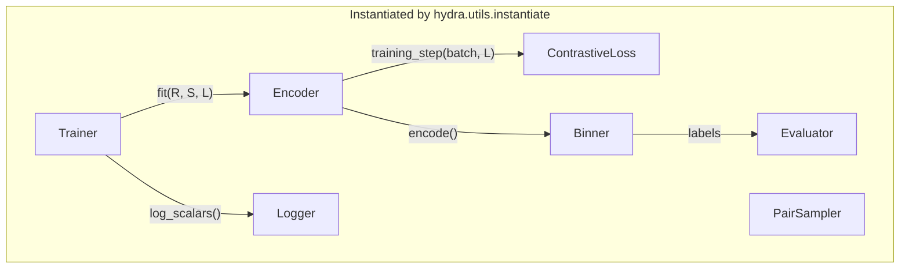

# Slots and Protocols

MegoBin has seven Protocols. You do not have to memorize them, but you do have to recognize them — every component you write or swap must satisfy one of these contracts. This chapter walks through all seven, shows the exact signatures (pulled from the repo), and explains why each one is shaped the way it is.

Every Protocol lives in a `base.py` next to the implementations it contracts. Every Protocol is decorated with `@runtime_checkable` so `isinstance(obj, Protocol)` works — which is what `tests/test_interfaces.py` uses to verify compliance.

## `Encoder` — the encoder contract

File: [`megobin/encoders/base.py`](https://github.com/Tinnifo/Metagenomic-Binning/blob/main/megobin/encoders/base.py)

```python
class Encoder(Protocol):
    def encode(self, features: np.ndarray) -> np.ndarray:
        """(N, input_dim) → (N, embedding_dim)."""
        ...

    @property
    def embedding_dim(self) -> int: ...

    def training_step(
        self,
        batch: tuple[torch.Tensor, ...],
        loss_fn: nn.Module,
    ) -> torch.Tensor: ...

    def parameter_groups(self) -> dict[str, list[nn.Parameter]]: ...
```

Four things. `encode` is the inference path used by the binner — NumPy in, NumPy out, no gradients. `embedding_dim` lets downstream components pre-allocate. `training_step` is called by the trainer with one batch produced by the `PairSampler`; the encoder chooses what intermediates to pass to the loss function (for UncertainGen that's `(μ, cov)` concatenations; for SemiBin it's plain embeddings) and returns a scalar loss. `parameter_groups` returns named parameter subsets so a phase-based trainer can freeze and unfreeze heads by name — at minimum `{"all": [...]}`, plus per-head groups for multi-head architectures.

Two implementations ship. `UncertainGenEncoder` (`megobin/encoders/uncertain_gen.py`) has `{"mean": [...], "cov": [...], "all": [...]}`. `SemiBinEncoder` (`megobin/encoders/semibin_encoder.py`) has just `{"all": [...]}` — it is single-phase.

The reason `training_step` lives on the encoder rather than on the trainer is that different encoders want to pass different things to the loss. A naive design ("trainer computes `forward`, passes it to `loss(z_i, z_j, label)`") forces every loss to accept plain embeddings — which breaks UncertainGen, whose Mahalanobis BCE needs the covariance too. Pushing the forward-plus-loss call down into the encoder keeps losses swappable with zero coupling to encoder internals.

## `ContrastiveLoss` — same/different label + two embeddings → scalar

File: [`megobin/losses/base.py`](https://github.com/Tinnifo/Metagenomic-Binning/blob/main/megobin/losses/base.py)

```python
class ContrastiveLoss(Protocol):
    def __call__(
        self, z_i: torch.Tensor, z_j: torch.Tensor, label: torch.Tensor
    ) -> torch.Tensor:
        """Pair of embeddings + same/different label → scalar loss"""
        ...
```

Trivially simple. Two batches of embeddings, a `(B,)` label tensor with 1 for must-link and 0 for cannot-link, scalar loss out. `z_i` and `z_j` can be whatever shape the paired encoder chose — the loss knows.

Two implementations: `HingeContrastiveLoss` (SemiBin's loss: `y·d² + (1-y)·max(0, 1-d)²` with L2 distance) and `MahalanobisBCELoss` (UncertainGen's: Mahalanobis distance → BCE on the exp). The Mahalanobis BCE accepts `(μ, cov)` concatenations via `include_std=True` and falls back to plain-embedding BCE via `include_std=False`; that's the flag the two-phase trainer flips between phases.

## `Binner` — embeddings → integer labels

File: [`megobin/binners/base.py`](https://github.com/Tinnifo/Metagenomic-Binning/blob/main/megobin/binners/base.py)

```python
class Binner(Protocol):
    def cluster(self, embeddings: np.ndarray) -> np.ndarray:
        """(N, d) → (N,) integer bin assignments"""
        ...
```

That's the whole contract. No training — binners are non-parametric in MegoBin (learned clustering modules would be a trainer + encoder combined, not a binner). No hyperparameter API — hyperparameters are set via the constructor, not via a method.

Two implementations: `InfomapBinner` (dual k-NN graph + community detection) and `DBSCANEnsembleBinner` (12 `eps` values, marker-gene F1 selection). Both use the construction-time kwargs in their config files: `configs/binner/infomap.yaml` has `k_neighbours: 200`, `n_trials: 10`; `configs/binner/dbscan_ensemble.yaml` has a list of 12 eps values and `min_samples: 5`.

## `Evaluator` — bin directory → DataFrame

File: [`megobin/evaluators/base.py`](https://github.com/Tinnifo/Metagenomic-Binning/blob/main/megobin/evaluators/base.py)

```python
class Evaluator(Protocol):
    def score(self, bins_dir: Path) -> pd.DataFrame:
        """Path to bin FASTAs → DataFrame with 'completeness' and 'contamination' columns"""
        ...
```

One implementation, `CheckM2Evaluator`. The wrapper runs `checkm2 predict -i <bins_dir> -o <tmp> --threads N`, parses `quality_report.tsv`, and returns a DataFrame. It raises `FileNotFoundError` if the CheckM2 binary is not on `PATH`, and `pipeline.py` catches that specifically — so the pipeline is runnable without CheckM2 for iteration.

## `PairSampler` — dataset-style, per-index tuple

File: [`megobin/data/base.py`](https://github.com/Tinnifo/Metagenomic-Binning/blob/main/megobin/data/base.py)

```python
class PairSampler(Protocol):
    def __len__(self) -> int: ...
    def __getitem__(self, idx: int) -> tuple[torch.Tensor, torch.Tensor, torch.Tensor]: ...
```

Samplers look like `torch.utils.data.Dataset` so they wrap cleanly in a standard DataLoader. Each `__getitem__` call returns `(feature_i, feature_j, label)`. Samplers never compute features themselves — they receive feature arrays at construction time. The pipeline's `_load_sampler_inputs` helper introspects the sampler class's `__init__` signature and passes only the arrays it declares as kwargs, so `pipeline.py` does not need to know whether a given sampler wants `features_whole`, `features_split`, or `cannot_link_pairs`.

Three implementations: `UncertainGenPairSampler` (random-pair sampling), `SemiBinPairSampler` (must-link from contig splitting, cannot-link random, cap at 4M pairs), `HybridPairSampler` (mixes random + taxonomy-aware with a configurable split).

## `Trainer` — the optimization loop

File: [`megobin/trainers/base.py`](https://github.com/Tinnifo/Metagenomic-Binning/blob/main/megobin/trainers/base.py)

```python
class Trainer(Protocol):
    def fit(
        self,
        encoder: nn.Module,
        sampler: Dataset,
        loss_fn: nn.Module,
    ) -> None: ...
```

`fit` mutates `encoder` in place. The trainer owns epochs, batching, optimizer stepping, scheduler stepping, gradient clipping, phase scheduling, and logger calls. The contract does not say how it does any of that — `SinglePhaseTrainer` runs one optimizer for N epochs; `TwoPhaseTrainer` runs two sequential phases with fresh optimizers.

This is the Protocol most likely to grow new implementations as the project evolves — a DDP trainer, a gradient-accumulation trainer, a cosine-warmup trainer. None of them require pipeline changes.

## `Logger` — experiment tracking backend

File: [`megobin/utils/logger.py`](https://github.com/Tinnifo/Metagenomic-Binning/blob/main/megobin/utils/logger.py)

```python
class Logger(Protocol):
    def log_scalars(self, values: dict[str, float], step: int) -> None: ...
    def log_config(self, config: dict[str, Any]) -> None: ...
    def log_text(self, key: str, text: str) -> None: ...
    def log_dataframe(self, key: str, df: pd.DataFrame) -> None: ...
    def log_checkpoint(self, path: Path, name: str = "checkpoint") -> None: ...
    def finish(self) -> None: ...
```

Six methods. Implementations are free to downgrade calls they cannot represent — e.g. TensorBoard has no rich table widget, so `TensorBoardLogger.log_dataframe` renders the DataFrame as markdown text. Two implementations: `TensorBoardLogger` (default) and `NoOpLogger` (for tests and quiet runs).

The Logger is the Protocol where the "swap one line of YAML, get a completely different backend" pattern pays off most visibly. `logger=none` gives you silent runs. `logger=tensorboard` gives you rich tracking. A hypothetical `logger=wandb` would just be another class conforming to the same six methods.

## How the pieces compose

A diagram is worth one more read:



Reading this top-down: Hydra instantiates all seven components from YAML. The trainer is handed the encoder, sampler, and loss and owns the optimization loop, calling `encoder.training_step(batch, loss_fn)` internally. The trainer logs scalars as it goes. When training finishes, the pipeline calls `encoder.encode(features)`, hands the embeddings to the binner, hands the labels to the FASTA-writer, and hands the FASTAs to the evaluator.

Every arrow in that diagram is a Protocol method call. None of the boxes import each other. That is the whole architecture.
