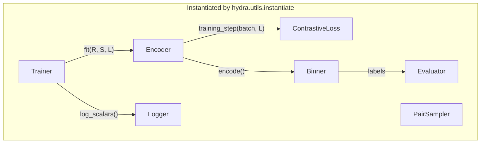

# Slots and Protocols

Seven Protocols. Each is `@runtime_checkable` and verified by `tests/test_interfaces.py`.

## `Encoder`

[`megobin/encoders/base.py`](https://github.com/Tinnifo/Metagenomic-Binning/blob/main/megobin/encoders/base.py)

```python
class Encoder(Protocol):
    def encode(self, features: np.ndarray) -> np.ndarray: ...
    @property
    def embedding_dim(self) -> int: ...
    def training_step(self, batch, loss_fn) -> torch.Tensor: ...
    def parameter_groups(self) -> dict[str, list[nn.Parameter]]: ...
```

- `encode` — NumPy → NumPy, no grad. Used by binner.
- `training_step` — one batch → scalar loss. Encoder picks what to pass to the loss.
- `parameter_groups` — named subsets for phase-based trainers. Minimum: `{"all": [...]}`.

`UncertainGenEncoder` exposes `{"mean", "cov", "all"}` so two-phase trainers can freeze each head independently.

`training_step` lives on the encoder so different encoders can pass different things to the loss (e.g. UncertainGen passes `(μ, cov)` concatenations).

## `ContrastiveLoss`

```python
class ContrastiveLoss(Protocol):
    def __call__(self, z_i, z_j, label) -> torch.Tensor: ...
```

`label`: 1 = must-link, 0 = cannot-link.

- `HingeContrastiveLoss` — SemiBin's loss.
- `MahalanobisBCELoss` — UncertainGen's. `include_std` flag flipped between phases.

## `Binner`

```python
class Binner(Protocol):
    def cluster(self, embeddings: np.ndarray) -> np.ndarray: ...
```

`(N, d)` → `(N,)` int labels. Non-parametric. Hyperparams via constructor.

- `DBSCANEnsembleBinner` — 12 eps, marker-gene F1 selection. Marker resolution either takes a precomputed `contig_to_marker` dict or calls `_call_markers_from_fasta`, which runs an ORF finder ([megobin/utils/orffinding.py](https://github.com/Tinnifo/Metagenomic-Binning/blob/main/megobin/utils/orffinding.py); default `fast-naive` is pure-Python, optional `prodigal`/`fraggenescan`) followed by `hmmsearch` against [megobin/utils/marker.hmm](https://github.com/Tinnifo/Metagenomic-Binning/blob/main/megobin/utils/marker.hmm) (107 single-copy markers, ported from SemiBin). HMMER must be on PATH; see [installation.md](../02-getting-started/installation.md#external-tools).

## `Evaluator`

```python
class Evaluator(Protocol):
    def score(self, bins_dir: Path) -> pd.DataFrame: ...
```

`CheckM2Evaluator` raises `FileNotFoundError` if CheckM2 not on PATH; `pipeline.py` catches and continues.

## `PairSampler`

```python
class PairSampler(Protocol):
    def __len__(self) -> int: ...
    def __getitem__(self, idx) -> tuple[Tensor, Tensor, Tensor]: ...
```

`Dataset`-shaped, returns `(feature_i, feature_j, label)`. Sampler declares its array kwargs in `__init__`; `pipeline.py` introspects and supplies them.

- `UncertainGenPairSampler`.

## `Trainer`

```python
class Trainer(Protocol):
    def fit(self, encoder, sampler, loss_fn) -> None: ...
```

Mutates `encoder` in place. Owns epochs, batching, optimizer, scheduler, clipping, phases, logger calls.

- `SinglePhaseTrainer`, `TwoPhaseTrainer`.

## `Logger`

```python
class Logger(Protocol):
    def log_scalars(self, values, step) -> None: ...
    def log_config(self, config) -> None: ...
    def log_text(self, key, text) -> None: ...
    def log_dataframe(self, key, df) -> None: ...
    def log_checkpoint(self, path, name="checkpoint") -> None: ...
    def finish(self) -> None: ...
```

`TensorBoardLogger` (default), `NoOpLogger` (silent).

## How they compose



No box imports another. That's the whole architecture.
