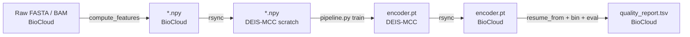

# Cross-cluster data flow

BioCloud has the data. DEIS-MCC has the GPUs. Connect with rsync.

## The round-trip



## Stage 1 — Features on BioCloud

Easiest path: let Snakemake's `compute_features` rule do it. Or manually:

```python
import numpy as np
from megobin.features.kmer_profiles import read_fasta, compute_kmer_profiles_with_splits

names, seqs = read_fasta('data/CAMI_medium/contigs.fasta')
filtered = [(n, s) for n, s in zip(names, seqs) if len(s) >= 1000]
kept_names = [n for n, _ in filtered]
kept_seqs  = [s for _, s in filtered]

whole, split = compute_kmer_profiles_with_splits(
    kept_seqs, k=4, canonical=True, alphabet='ATGC',
    pseudocount=1e-5, min_length=1000, split_min_length=2000,
)
np.save('data/CAMI_medium/kmer_profiles.npy', whole)
np.save('data/CAMI_medium/kmer_profiles_split.npy', split)
np.save('data/CAMI_medium/contig_names.npy', np.array(kept_names))
```

## Stage 2 — Ship features to DEIS-MCC

```bash
rsync -avz --progress \
  tinni@biocloud.cmc.aau.dk:/projects/microbial-dark-matter/metagenomic-binning/Metagenomic-Binning/data/CAMI_medium/ \
  DB56HW@student.aau.dk@ailab-fe01.srv.aau.dk:/work/DB56HW@student.aau.dk/metagenomic-binning/data/CAMI_medium/
```

Two-hop pull via laptop if direct SSH isn't configured. Only `.npy` files needed — original FASTA stays on BioCloud.

## Stage 3 — Train on DEIS-MCC

```bash
ssh DB56HW@student.aau.dk@ailab-fe01.srv.aau.dk
cd /work/DB56HW@student.aau.dk/metagenomic-binning/Metagenomic-Binning
sbatch hpc/slurm/deis_mcc_train.sh uncertain_gen CAMI_medium
```

Output: `results/CAMI_medium/uncertain_gen/model.pt`.

## Stage 4 — Ship checkpoint back

```bash
rsync -avz --progress \
  DB56HW@student.aau.dk@ailab-fe01.srv.aau.dk:/work/.../results/CAMI_medium/uncertain_gen/model.pt \
  tinni@biocloud.cmc.aau.dk:/projects/microbial-dark-matter/metagenomic-binning/Metagenomic-Binning/results/CAMI_medium/uncertain_gen/model.pt
```

Typical UncertainGen checkpoint ~2 MB.

## Stage 5 — Evaluate on BioCloud

```bash
sbatch --wrap "mamba activate megobin && \
  python megobin/pipeline.py \
    --config-name experiment/training/uncertain_gen_cami_toy \
    resume_from=results/CAMI_medium/uncertain_gen/model.pt \
    dataset=CAMI_medium \
    binner=infomap"
```

## Path conventions

- `data/<dataset>/` on both clusters (override with `data_dir=` on DEIS-MCC scratch).
- `outputs/<date>/<time>/` — Hydra default, same on both.
- Checkpoints are CUDA-device-independent (`map_location='cpu'` on load). Trains anywhere, runs anywhere.

Don't hardcode `/work/DB56HW@student.aau.dk/...` into a YAML — that's a DEIS-only config.

## Pre-flight checklist

1. Features on BioCloud? (`ls data/<dataset>/*.npy`)
2. Features on DEIS-MCC? (`ssh mcc ls /work/.../data/<dataset>/*.npy`)
3. Container on DEIS-MCC? (`ssh mcc ls /work/.../megobin.sif`)
4. Git SHAs match? (`git rev-parse HEAD` on both)
5. `environment.yml` matches? (`sha256sum environment.yml`)
6. Submit: `sbatch hpc/slurm/deis_mcc_train.sh ...`
7. On done: rsync `model.pt` back.
8. BioCloud: `pipeline.py resume_from=<ckpt>`.
9. View in TB via SSH-forwarded port.

## Why no shared filesystem

Different network segments, separate admins. Ask Sebastian for history. Workaround = rsync. Keep shipped files small.

## Sources

- [hpc/Snakefile](https://github.com/Tinnifo/Metagenomic-Binning/blob/main/hpc/Snakefile)
- [hpc/slurm/biocloud_pipeline.sh](https://github.com/Tinnifo/Metagenomic-Binning/blob/main/hpc/slurm/biocloud_pipeline.sh)
- [hpc/slurm/deis_mcc_train.sh](https://github.com/Tinnifo/Metagenomic-Binning/blob/main/hpc/slurm/deis_mcc_train.sh)
